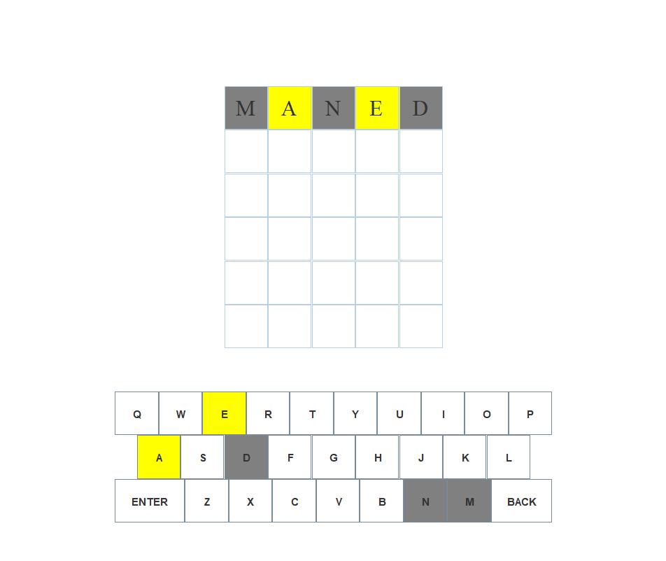

# Wordle Recreation

Recreation of The New York Times’ Wordle in Java using a graphical user interface. The program selects from over 5000 words to consistently provide unique puzzles for users to solve.

